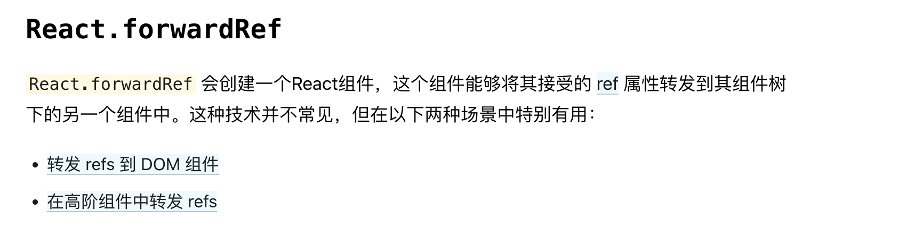

# react-demo
hooks,components,redux,router

## react hooks
> ⚠️ [hooks rules](https://zh-hans.reactjs.org/docs/hooks-rules.html)

todo:
- [useState](https://reactjs.org/docs/hooks-reference.html#usestate)
  - ⚠️ 如何拆分state？
- [useEffect](https://reactjs.org/docs/hooks-reference.html#useeffect)
  - ⚠️ 如何避免不必要的更新？
  - ⚠️ 使用多个 Effect 实现关注点分离
- [useContext](https://reactjs.org/docs/hooks-reference.html#usecontext)
  - [context](https://zh-hans.reactjs.org/docs/context.html)
    > 组件树中很多不同层级的组件需要访问同样的一批数据，则用**context**。其他props属性传递可以考虑**组件组合**。
    > 
    > consumers组件如何修改context的值。
    - `const MyContext = React.createContext(defaultValue);`
    - `<MyContext.Provider value={contextValue}></MyContext.Provider>`
    - `<MyContext.Consumer>{(value) => {}}</MyContext.Consumer>`
    - `useContext(MyContext)`
- [useReducer](https://reactjs.org/docs/hooks-reference.html#usereducer)
  - ⚠️ ⚠️ ⚠️ useReducer正确的使用场景，如何合理的使用它？
  > 适用场景：state逻辑较复杂且包含多个子值，或者下一个state依赖于之前的state等情况。
  >
  > reducer是将数据内容于更新行为分开的。UI与业务逻辑分开维护。
  - `const [state, dispatch] = useReducer(reducer, initialState);`
  - 指定初始state：**initialState**使用state的值
  - 惰性初始化： **便于reset数据**，`const [state, dispatch] = useReducer(reducer, initialState,init);`
- [useMemo](https://reactjs.org/docs/hooks-reference.html#usememo)
  > ⚠️ 具体的性能优化方式是什么？
  > ⚠️ 传入**useMemo**的函数会在渲染期间执行，**副作用**的操作应该放在**useEffect**中。
  > 优化性能？如何来优化性能？【避免每次渲染时都进行高开销的计算】
  - `const memoizedValue = useMemo(() => computeExpensiveValue(deps), [deps]);`
- [useCallback](https://reactjs.org/docs/hooks-reference.html#usecallback)
  > ⚠️ 具体的性能优化方式是什么？
  > useCallback(fn, deps) 相当于 useMemo(() => fn, deps)。
  - `const memoizedCallback = useCallback(callback, [deps]);`
- [useRef](https://reactjs.org/docs/hooks-reference.html#useref)
  > 返回可变的ref对象,返回的 ref 对象在组件的整个生命周期内持续存在。
  > ⚠️ 确保ref.current对象存在，保证代码的健壮性。
  - `const ref = useRef(null);`
- [useImperativeHandle](https://zh-hans.reactjs.org/docs/hooks-reference.html#useimperativehandle)
  > **useImperativeHandle**可以让你在使用**ref**时自定义暴露给父组件的实例值。
  > 
  > 结合forwardRef使用 
  - `useImperativeHandle(ref, createHandle, [deps])`
- [useLayoutEffect](https://reactjs.org/docs/hooks-reference.html#uselayouteffect)
- [useCustomHooks](https://reactjs.org/docs/hooks-custom.html#extracting-a-custom-hook)

